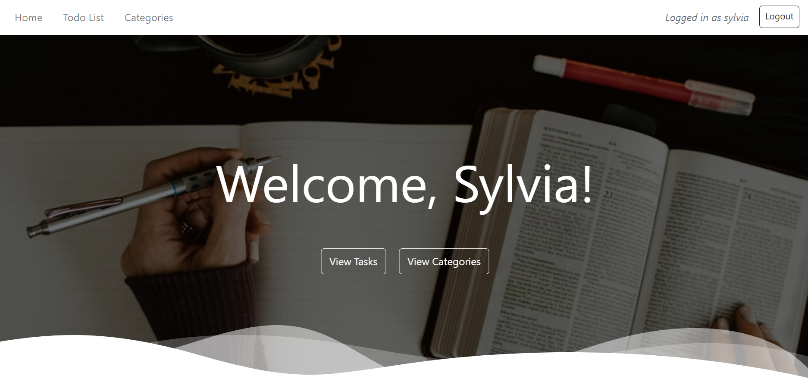
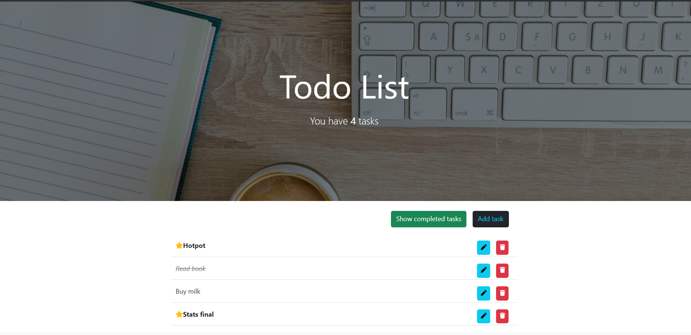
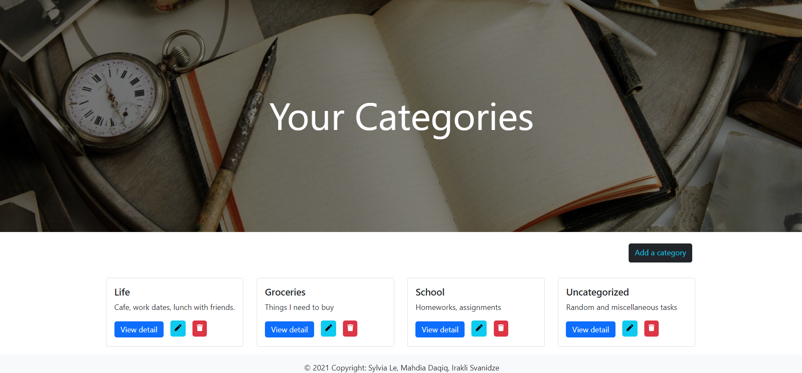

# Django Todo List

A todo list app developed using Django framework





## Installation & Usage

Clone the project on your machine and run the virtual environment (I use pipenv, please install this package if you don't have).

```bash
pipenv shell
```

Finally, run the command:

```bash
python manage.py runserver
```

You can open http://localhost:8000 to view the page.


## Problems and Future update

Deploy this project on Heroku and make sure everything runs smoothly

Make changes in style to the CRUD pages.

## Contributing
Pull requests are welcome. For major changes, please open an issue first to discuss what you would like to change.

Please make sure to update tests as appropriate.
